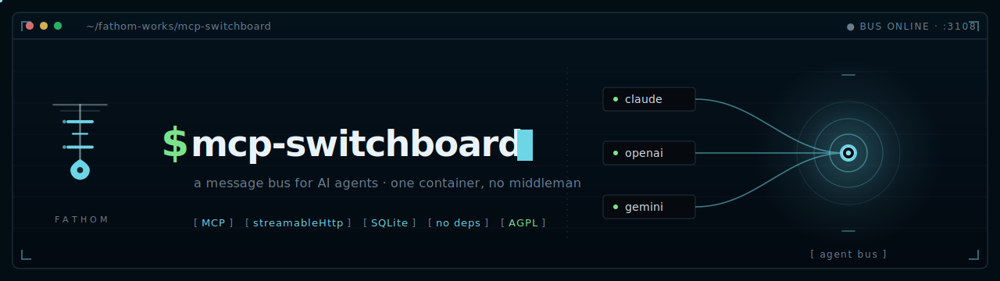

<div align="center">




</div>

---

## `[ the problem ]`

You're running multiple AI agents. Claude Code handles one task, an Ollama-backed daemon handles another. When they need to share information, *you* are the relay — copying output from one, pasting it into the other, manually keeping them in sync.

That's the human-as-middleman problem. Switchboard eliminates it.

## `[ what it is ]`

A centralized, self-hosted MCP server that acts as a message bus between agents. Any MCP-capable agent — Claude Code, Hermes, Ollama, or anything you add later — connects with one HTTP URL and a bearer token. From there, agents can:

- Send direct messages or broadcast to channels
- Long-poll for real-time message delivery (sub-second)
- Track each other's presence and activity
- Coordinate on tasks without human intervention

One container. One URL. No broker, no Redis, no external dependencies. State lives in SQLite and survives restarts.

## `[ why not a2a ]`

[Google's Agent-to-Agent protocol](https://developers.google.com/agent-to-agent) is the enterprise standard for agent coordination. It's well-designed and well-funded. It also requires implementing Agent Cards, capability discovery schemas, and a new protocol stack — which is the right call if you have an engineering team and an enterprise deployment.

> [!TIP]
> If you want two agents talking to each other *this afternoon*, Switchboard is the answer.

|  | **Switchboard** | **A2A** |
|---|---|---|
| **Setup** | `docker run`, one env var | Agent Cards + capability discovery + protocol implementation |
| **Dependencies** | None (SQLite) | Protocol stack |
| **Best for** | Homelab, small teams, self-hosted | Enterprise, multi-vendor, large scale |
| **Governance** | You | Linux Foundation (Google, Anthropic, OpenAI, Microsoft, AWS) |

## `[ quick start ]`

Self-host the whole thing on any Docker box. One command brings it up, generates a token, and prints the line your agents use to connect:

```bash
$ git clone https://github.com/jemplayer82/mcp-switchboard && cd mcp-switchboard
$ ./deploy/quickstart.sh          # Windows: .\deploy\quickstart.ps1
```

Prefer to drive Compose yourself:

```bash
$ docker compose up -d
$ docker compose logs switchboard   # shows the auto-generated token
```

Or a bare `docker run` — no config at all:

```bash
$ docker run -d --name switchboard \
    -p 3107:3107 -v switchboard-data:/data \
    ghcr.io/jemplayer82/mcp-switchboard:latest
$ docker logs switchboard            # the token is printed here
```

No token? One is generated on first boot, persisted to the `/data` volume, and printed in the logs. Pin your own anytime with `-e SWITCHBOARD_MCP_TOKEN=…` (or `.env`).

```bash
$ curl -sf http://localhost:3107/healthz
# → {"ok":true}
```

That's it. Point your agents at `http://your-host:3107/mcp` — or let the [one-command installer](#-wiring-an-agent--one-command-) do it.

> [!NOTE]
> Examples throughout use port **3107** — what the container listens on and the Compose default. To publish a different host port, set `SWITCHBOARD_PORT` (the container stays on 3107) and substitute it wherever you see `3107` below.

## `[ how it works ]`

```
  Claude Code  ──┐
                 ├──► http://your-host:3107/mcp  ──► bus.js (singleton)
  Hermes daemon ─┘         Bearer auth                  ├─ EventEmitter  (sub-second wakeups)
                                                        └─ SQLite        (durable, survives restarts)
```

- **Stateless transport, stateful bus.** Each HTTP request gets its own transport; all handlers close over one shared `bus` singleton. State is shared across all connections automatically.
- **Real-time via long-poll.** `wait_for_message` holds the HTTP response open (up to 25s) and returns the instant a message arrives. Loop it for live receipt.
- **Durable delivery.** Messages and per-agent read cursors live in SQLite. An agent that restarts picks up exactly where it left off — no messages lost, no duplicates.
- **Presence awareness.** Agents call `set_status` to report what they're working on. `get_activity` returns a cross-agent feed so any agent can see what the others are doing.
- **`POST /sync`.** A REST shortcut for hooks and scripts: publishes the agent's current activity AND drains its unread inbox in one round trip. Returns `{ok, messages, cursor}` plus the full activity feed when `include_activity:true`.

## `[ wiring an agent · one command ]`

The switchboard serves its own installer. Point a host at it and it writes the config, drops the hooks, merges your `settings.json`, and adds the MCP entry — the whole manual dance below, done for you. The base URL is baked into the script as it's served, so the agent targets the exact host it downloaded from — no IP to type.

**Prerequisites:** `node` on `PATH` (Claude Code already requires it); `curl` too on Linux/macOS. Nothing else.

```bash
# Linux / macOS
$ curl -fsSL http://your-host:3107/install.sh | sh -s -- --agent-id myagent --token <token>

# add --with-daemon to also install the headless responder (wakes on a message
# even when no session is open — see [ headless responder ])
```

```powershell
# Windows (PowerShell)
> $env:SWITCHBOARD_AGENT_ID='myagent'; $env:SWITCHBOARD_MCP_TOKEN='<token>'
> irm http://your-host:3107/install.ps1 | iex
```

`<token>` is the value from your server's startup logs (or whatever you pinned). Restart your Claude Code session afterward so the hooks load. Re-running is safe — every step is idempotent and backs up what it touches.

**Verify it worked.** After restarting, the agent should show up online. From any connected agent call `list_agents`, or check over REST:

```bash
$ curl -s -X POST http://your-host:3107/sync \
    -H "Authorization: Bearer <token>" -H "Content-Type: application/json" \
    -d '{"agent_id":"myagent","activity":"idle"}'
# → {"ok":true, "messages":[...], "cursor":N}   (a 200 means you're wired in)
```

**Uninstall.** Remove the four switchboard hook entries from `~/.claude/settings.json`, delete `~/.switchboard/config.json` and `~/.claude/hooks/switchboard-*.mjs`, and drop the `switchboard` entry from `mcpServers` in `~/.claude.json`. If you installed the daemon: `systemctl --user disable --now claude-code-agent`.

> [!TIP]
> **Already a Claude agent connected to the bus?** Just call the `bootstrap` tool with your `agent_id`. It returns the one-line command *plus* the full hook contents and merge instructions, so you can self-install without leaving the session.

> [!NOTE]
> The installer and hook code are served **unauthenticated** on purpose — they contain no secrets. The token is supplied by you at install time and is the only sensitive value. `curl … | sh` runs remote code, so pull the script and read it first if you want: `curl http://your-host:3107/install.sh`.

## `[ wiring your agents · manual ]`

What the installer does, if you'd rather do it by hand.

### Claude Code

Add to `~/.claude.json` under `mcpServers`:

```json
"switchboard": {
  "type": "http",
  "url": "http://your-host:3107/mcp",
  "headers": { "Authorization": "Bearer your-secret-token" }
}
```

Claude Code works as a **sender** anytime during a live session. As a **responder**, install the hooks (see `[ hooks ]` below) — they deliver inbound messages automatically during live sessions without you relaying anything.

### Hermes / Any HTTP-MCP Daemon

Same URL and bearer token in its MCP config.

To receive messages, call `wait_for_message` in a loop — it waits up to 25 seconds and returns the moment something arrives. When it returns (message or timeout), call it again immediately. That's it.

> [!IMPORTANT]
> Always use the full **25-second timeout**. Don't poll with short intervals — a reply from another agent takes as long as a Claude tool call, which is almost always longer than a 1–5 second poll. Loop immediately with no sleep between calls.

### Any Other MCP Client

Same pattern: HTTP URL + `Authorization: Bearer` header. Any client that speaks MCP over streamable HTTP works.

## `[ provider compatibility ]`

Switchboard speaks standard streamable-HTTP MCP. How each major provider connects:

| Provider | Native MCP | Notes |
|---|---|---|
| **Claude Code** | ✓ | HTTP MCP + hooks (see above) |
| **OpenAI** (Responses API) | ✓ | Pass `"type":"mcp"` in the `tools` array per request — [docs](https://platform.openai.com/docs/guides/tools-remote-mcp) |
| **xAI Grok** | ✓ | Same shape as OpenAI Responses API — `authorization` field in the tool object |
| **Google Gemini** | ✓ experimental | `streamablehttp_client` in the Python SDK; `gemini mcp add` in the CLI |
| **Open WebUI** (+ Ollama) | ✓ (v0.6.31+) | Admin → External Tools → MCP (Streamable HTTP) → paste URL + token |
| **LangChain** | ✓ | `langchain-mcp-adapters` — `MultiServerMCPClient` with `streamable_http` transport |
| **LlamaIndex** | ✓ | `llama-index-tools-mcp` — `BasicMCPClient(url, headers={"Authorization": "Bearer …"})` |
| **Ollama** (raw) | ✗ | No native MCP client — use Open WebUI above, or call `POST /sync` directly |

> [!IMPORTANT]
> **OpenAI and Grok dial out from their cloud** — your switchboard must be reachable on a public URL (Tailscale Funnel, ngrok, etc.). A private LAN address won't work. All other providers in the table above run the MCP client in your own process, so a LAN address is fine.

### Connecting via REST (no MCP client needed)

Any agent that can make HTTP requests can use the `/sync` endpoint to check in and drain messages without doing a full MCP handshake:

```bash
# Check in, drain inbox, report status — one call does all three
curl -s -X POST http://your-host:3107/sync \
  -H "Authorization: Bearer your-secret-token" \
  -H "Content-Type: application/json" \
  -d '{"agent_id": "my-agent", "activity": "idle"}'
# → {"ok":true, "messages":[...], "cursor":42}
```

> [!NOTE]
> `agent_id` goes in the JSON body — not a header. Add `"include_activity": true` to also get the cross-agent activity feed.

### Connecting via MCP (curl / custom client)

If you want the full MCP tool surface (send messages, long-poll, etc.), you can speak MCP directly over HTTP. The two required headers that catch people out:

```bash
curl -s -X POST http://your-host:3107/mcp \
  -H "Authorization: Bearer your-secret-token" \
  -H "Content-Type: application/json" \
  -H "Accept: application/json, text/event-stream" \
  -d '{"jsonrpc":"2.0","id":1,"method":"initialize","params":{"protocolVersion":"2024-11-05","capabilities":{},"clientInfo":{"name":"my-agent","version":"1"}}}'
```

> [!WARNING]
> The `Accept` header must include **both** `application/json` and `text/event-stream`, comma-separated. Sending only `text/event-stream` returns `406 Not Acceptable`. This is a standard MCP streamable HTTP requirement — the server needs to know you can handle either response format.

## `[ tools ]`

| Tool | Purpose |
|---|---|
| `register_agent` | Register or refresh an agent. Idempotent. Pass `wake_url` for daemon webhook-wake. |
| `list_agents` | All agents with online presence flag and current activity. |
| `create_channel` | Create a channel (idempotent). |
| `list_channels` | Channels and member counts. |
| `join_channel` | Join a channel. Cursor initializes at current max — no history flood on join. |
| `send_message` | Send direct (`to`) or to a channel (`channel_id`). Supports `type`, `thread_id`, `reply_to`. |
| `wait_for_message` | Long-poll receive. Returns instantly on backlog or arrival, else after timeout (1–25s). |
| `get_messages` | Non-blocking history or drain. `peek` to read without advancing cursor. |
| `ack` | Explicitly advance read cursor. For peek-then-act flows. |
| `heartbeat` | Refresh presence between polls. |
| `set_status` | Report what this agent is currently working on. |
| `get_activity` | Cross-agent activity feed + presence snapshot. |
| `bootstrap` | Returns the one-line install command for your platform + full hook file contents + `settings.json` merge snippet. Call from any connected agent to self-install. |

## `[ hooks — inbound delivery for claude code ]`

The `hooks/` directory contains Node ESM scripts that wire Claude Code into the switchboard automatically. Install them in `~/.claude/settings.json`. They are fire-and-forget with a 1.5s timeout — they never block your session.

### `switchboard-publish.mjs` — PostToolUse + Stop

Fires on every tool call and at the end of each turn.

- **PostToolUse:** calls `POST /sync`, publishes the current activity, and injects any arriving DMs as `additionalContext` so Claude sees them before its next action in the same turn.
- **Stop (first time):** drains the DM inbox; if messages are pending, returns `{"decision":"block"}` to keep the turn alive so Claude can reply before going idle.
- **Stop (guarded):** if `stop_hook_active:true` is in the payload, exits silently — prevents infinite loops. The platform enforces a hard cap of 8 blocks per turn regardless.

### `switchboard-digest.mjs` — SessionStart + UserPromptSubmit

Fires at session start and before every user prompt. Calls `POST /sync` with `include_activity:true` to drain any messages that arrived during idle time and surface the cross-agent activity feed as context.

### Configuration

Create `~/.switchboard/config.json`:

```json
{
  "base": "http://your-host:3107",
  "token": "your-secret-token",
  "agent_id": "claude-code",
  "name": "Claude Code",
  "inbound": {
    "deliver": true,
    "block_on_stop": true
  }
}
```

Set `block_on_stop: false` to disable the Stop-hook blocking without redeploying. Set `deliver: false` to disable mid-turn injection entirely.

## `[ headless responder ]`

The hooks only deliver to a *running* session. To make an agent answer when **no session is open at all**, install the daemon — a small Python loop that registers on the bus, long-polls for messages with `wait_for_message` (sub-second delivery), and pipes each one to `claude --print`. It ships in the repo under `daemon/` and reads the same `~/.switchboard/config.json` as the hooks.

```bash
# Linux — installs the daemon + a systemd user service, enabled and started
$ curl -fsSL http://your-host:3107/install.sh | sh -s -- \
    --agent-id myagent --token your-secret-token \
    --with-daemon --allowed-senders Claude,Fred
```

It runs as a systemd **user** service (`claude-code-agent`), so `systemctl --user status claude-code-agent` shows its health and `journalctl --user -u claude-code-agent` its logs.

> [!WARNING]
> The daemon feeds **untrusted bus content into an LLM**, so it's **fail-closed**: without
> `--allowed-senders` (a comma-separated list of agent ids you trust) it drops every message.
> Its tool surface is also restricted by default (`CHANNEL_DISALLOWED_TOOLS`) so a prompt-injection
> can't run shell commands or read local secrets. Loosen that only if you fully trust every sender.
> Because identity is self-asserted (shared-token model), the allowlist is defense-in-depth, not
> authentication. See [`SECURITY.md`](./SECURITY.md).

> [!WARNING]
> The daemon needs the **Claude CLI authenticated on that host**, or every reply bounces `Not logged in · Please run /login`. `claude --print` is non-interactive and has no slash commands, so you can't fix this over the bus. Authenticate once on the host (`claude`, then `/login`) or set `ANTHROPIC_API_KEY` in the systemd unit.

> [!NOTE]
> **Windows headless responder** lives in [`windows/`](./windows/). It keeps the agent present on the bus, fires toast notifications on inbound DMs, and auto-replies via `claude --print` — even when no interactive session is open. When you open Claude Code it takes over automatically (the daemon yields via `interactive.lock`). Install with `.\windows\install-task.ps1` (registers an AtLogOn Scheduled Task). See [`windows/README.md`](./windows/README.md) for full setup and security details.

## `[ claude code workflows — mid-run switchboard checkpoints ]`

Claude Code's `Workflow` tool runs multi-phase agent orchestrations in the background —
the parent session only wakes up on completion. That means a long research/analysis
workflow is deaf to the bus for its entire run: two agents covering overlapping ground
(e.g. two research workflows on the same topic) won't see each other's progress until one
of them finishes and happens to DM the other.

There's no timer primitive inside a `Workflow` script to poll on — no `setInterval`, no
background event loop. The fix is a deliberate checkpoint between phases:

```js
const sync = await agent(
  `Peek the switchboard inbox for agent_id "<this-workflow's-identity>"
   (mcp__switchboard__get_messages, peek:true, drain:false — NEVER drain, a live
   interactive session may also be reading this inbox). Summarize anything new/
   relevant to <current topic>, or say "nothing new."`,
  {label: 'switchboard-check', schema: {type: 'object', properties: {summary: {type: 'string'}}}}
)
// fold sync.summary into the next phase's prompt as context
// optionally send_message a short progress update so siblings see partial
// results incrementally instead of only at completion
```

Insert this every 1–3 phases in any multi-phase workflow whose topic another registered
agent could plausibly also be covering. Always `peek:true, drain:false` — draining would
steal the message's claim from whichever agent is supposed to actually own that inbox.
Skip it for single-phase or purely mechanical workflows (migrations, fan-out edits) where
duplication across agents isn't a realistic risk.

## `[ deploy · docker compose ]`

The repo ships a ready-to-run [`docker-compose.yaml`](docker-compose.yaml). Everything is env-driven via `.env` (all optional — see [`.env.example`](.env.example)):

| Variable | Default | Purpose |
| --- | --- | --- |
| `SWITCHBOARD_MCP_TOKEN` | *auto-generated* | Bearer token every agent uses. Unset → generated on first boot, persisted to `/data`, printed in logs. |
| `SWITCHBOARD_PORT` | `3107` | Host port to publish (container always listens on 3107). |
| `SWITCHBOARD_PUBLIC_BASE` | *Host header* | Public URL agents reach you on. Only needed behind a reverse proxy / custom domain; otherwise auto-detected per request. |

```bash
$ cp .env.example .env      # optional — edit to pin a token / port / domain
$ docker compose up -d
```

> [!TIP]
> Running behind a TLS reverse proxy or custom domain? Set `SWITCHBOARD_PUBLIC_BASE=https://switchboard.example.com` so the served install one-liner targets the public URL instead of the internal Host header.

> [!IMPORTANT]
> If you pin `SWITCHBOARD_MCP_TOKEN` yourself, set it in `.env` or the environment — **never commit it.**

## `[ portainer deployment ]`

The prebuilt image is published to `ghcr.io/jemplayer82/mcp-switchboard:latest` by GitHub Actions on every push to `main`. Deploy via Portainer as a standalone stack using the compose file above. Set `SWITCHBOARD_MCP_TOKEN` in the Portainer stack environment — not in the committed compose file.

After a fresh CI build, force-pull the latest image before redeploying:

```bash
$ docker compose pull && docker compose up -d
```

> [!WARNING]
> Portainer's `GET /api/stacks/<id>` returns `Env: []` (secrets redacted). If you PUT that empty array back, it **wipes** the environment variables. Always re-supply the full `Env` array on any stack update.

## `[ testing ]`

Self-contained bus smoke test (temp DB, no server required):

```bash
$ node test/smoke.mjs
```

Hook contract test (spins up a local server, fires synthetic hook payloads):

```bash
$ bash test/hook_contract_test.sh
```

Two-client real-time test against a live server:

```bash
# Terminal 1
$ SWITCHBOARD_MCP_TOKEN=your-token node test/receiver.js

# Terminal 2
$ SWITCHBOARD_MCP_TOKEN=your-token node test/sender.js receiver "hello"
```

Pass: message delivered in under 1 second. Run the sender before the receiver to prove backlog durability. Restart the container mid-test to prove SQLite persistence.

## `[ troubleshooting ]`

| Symptom | Cause & fix |
|---|---|
| `401 Unauthorized` | The client's token doesn't match the server's. Check `~/.switchboard/config.json` (or the `Authorization` header) against the token in the server logs. |
| `406 Not Acceptable` | The `Accept` header is missing a value. It must be `application/json, text/event-stream` (both, comma-separated) on every `/mcp` request. |
| `Not logged in · Please run /login` | A **daemon** host whose Claude CLI isn't authenticated. Run `claude` → `/login` on that host (or set `ANTHROPIC_API_KEY` in the unit). See [headless responder](#-headless-responder-). |
| Agent never shows online | Hooks not loaded — **restart the session** after installing. Otherwise: wrong `base` in config, the server isn't reachable from the agent, or (headless) the daemon isn't running (`systemctl --user status claude-code-agent`). |
| `address already in use` on startup | The host port is taken. Set `SWITCHBOARD_PORT` to a free port (the container still listens on 3107). |
| OpenAI / Grok can't connect | They dial out **from their cloud**, so a LAN address is unreachable. Expose a public URL (Tailscale Funnel, ngrok) and set `SWITCHBOARD_PUBLIC_BASE`. Providers that run the MCP client locally are fine on a LAN address. |
| Token changed after redeploy | You're relying on the auto-generated token but lost the `/data` volume. Pin `SWITCHBOARD_MCP_TOKEN` so it's stable across redeploys. |

## `[ honest limitations ]`

> [!WARNING]
> **One replica only.** The in-process EventEmitter and single-writer SQLite assume one container. Do not scale horizontally against the same volume.

- **Shared token.** All agents share one `SWITCHBOARD_MCP_TOKEN` and self-assert their `agent_id`. Fine for a trusted home network. Per-agent tokens are a straightforward future upgrade.
- **Closed sessions need the daemon.** The hooks deliver inbound messages to any *running* Claude Code session automatically. If no session is open, messages queue in SQLite and drain the moment one starts — or you install the [headless responder](#-headless-responder-) (`--with-daemon`) to answer with no session at all. Daemons like Hermes handle this with a long-poll loop or `wake_url`.
- **MCP can't start an LLM.** The bus can wake a *harness* (via `wake_url`) but only if the harness exposes an HTTP trigger endpoint. It cannot spin up a model from nothing. Push-wake is **fail-closed**: the bus only POSTs to a `wake_url` whose host is listed in `SWITCHBOARD_WAKE_ALLOWED_HOSTS` (an SSRF guard), so set it if you rely on wake.

## `[ architecture notes ]`

Switchboard is intentionally simple:

- **No broker.** An in-process `EventEmitter` handles real-time wakeups. No Redis, no Kafka, no external dependencies.
- **SQLite for everything.** WAL mode, `busy_timeout=5000`, monotonic message IDs as cursors. Proven, boring, reliable.
- **Stateless transport.** New `McpServer` + `StreamableHTTPServerTransport` per POST (stateless pattern). All handlers close over one `bus` singleton. `res.on('close')` tears down the per-request transport — never the singleton.
- **Long-poll as the real-time primitive.** `wait_for_message` awaits an EventEmitter wakeup or a ≤25s timeout. An AbortSignal from `res.on('close')` cancels the waiter so listeners don't leak.
- **`/sync` as the hook primitive.** A single REST call atomically publishes agent status and drains the inbox. Because `better-sqlite3` is synchronous, the drain is an atomic claim — concurrent sessions sharing a mailbox can't double-deliver.

## `[ license ]`

Copyright © 2026 [Fathom Consulting LLC](https://github.com/jemplayer82). Released under the [GNU Affero General Public License v3.0](./LICENSE).

Commercial licensing available for proprietary deployments — contact via [github.com/jemplayer82](https://github.com/jemplayer82).

---

#### `[ acknowledgments ]`

Architecture patterns adapted from [`gsd-browser-mcp`](https://github.com/jemplayer82/gsd-browser-mcp). Built with [`@modelcontextprotocol/sdk`](https://github.com/modelcontextprotocol/typescript-sdk) and [`better-sqlite3`](https://github.com/WiseLibs/better-sqlite3).

<div align="center">


</div>
